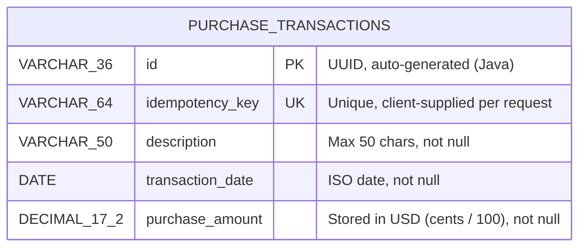

# WEX Purchase Transaction API — Technical Specification

**Version:** 1.2.0
**Language:** Java 21
**Framework:** Spring Boot 3.2.x
**Last Updated:** 2025-05-25

---

## Table of Contents

1. [Overview](#1-overview)
2. [Requirements Summary](#2-requirements-summary)
3. [Architecture](#3-architecture)
4. [Technology Stack](#4-technology-stack)
5. [Project Structure](#5-project-structure)
6. [Data Model](#6-data-model)
7. [API Design](#7-api-design)
8. [Business Logic](#8-business-logic)
9. [External Integration — Treasury API](#9-external-integration--treasury-api)
10. [Validation Rules](#10-validation-rules)
11. [Error Handling](#11-error-handling)
12. [Testing Strategy](#12-testing-strategy)
13. [Code Quality — Coverage & Linting](#13-code-quality--coverage--linting)
14. [Pre-commit Hook](#14-pre-commit-hook)
15. [OpenAPI Specification](#15-openapi-specification)
16. [Configuration](#16-configuration)
17. [Local Setup & Developer Onboarding](#17-local-setup--developer-onboarding)
18. [Design Decisions & Trade-offs](#18-design-decisions--trade-offs)

---

## 1. Overview

The WEX Purchase Transaction API is a RESTful backend service that allows clients to:

1. **Store** a purchase transaction in USD — idempotently, preventing duplicates via a client-supplied `Idempotency-Key` header.
2. **Retrieve** a stored transaction with the purchase amount converted to a target currency, using exchange rates published by the US Treasury Reporting Rates of Exchange API.

The service is built for production readiness: validated inputs, idempotent writes, structured error responses, full automated test coverage, and an externally configurable datasource and Treasury API URL.

---

## 2. Requirements Summary

### Requirement 1 — Store a Purchase Transaction

| Field | Type | Constraint |
|---|---|---|
| `Idempotency-Key` | Header (String) | Required, max 64 characters; prevents duplicate transactions |
| `description` | String | Required, max 50 characters |
| `transactionDate` | Date | Required, ISO format `YYYY-MM-DD` |
| `purchaseAmountCents` | Long | Required, non-negative integer (cents); e.g. `9999` = $99.99, `0` = $0.00 |
| `id` | UUID | Auto-generated on store; uniquely identifies the transaction |

### Requirement 2 — Retrieve a Transaction in a Target Currency

- Look up a stored transaction by UUID.
- Call the [US Treasury Reporting Rates of Exchange API](https://fiscaldata.treasury.gov/datasets/treasury-reporting-rates-exchange/treasury-reporting-rates-of-exchange) to fetch the exchange rate for the target currency.
- Apply the exchange rate to the USD amount and return the converted value rounded to 2 decimal places.

**Exchange rate lookup rules:**
- Must use a rate with `record_date` ≤ purchase date.
- Rate must be within 6 months before the purchase date.
- If no qualifying rate exists → return an error (HTTP 422).
- No exact date match required; use the most recent available rate in the window.

---

## 3. Architecture

```
Client
  │
  ▼
┌─────────────────────────────────────────┐
│         Spring Boot Application          │
│                                          │
│  ┌──────────────────────────────────┐   │
│  │   PurchaseTransactionController  │   │  ← REST layer (validation, routing)
│  └────────────────┬─────────────────┘   │
│                   │                      │
│  ┌────────────────▼─────────────────┐   │
│  │   PurchaseTransactionService     │   │  ← Business logic, idempotency, orchestration
│  └──────┬─────────────────┬─────────┘   │
│         │                 │              │
│  ┌──────▼──────┐  ┌───────▼──────────┐  │
│  │ Transaction │  │ TreasuryExchange  │  │
│  │ Repository  │  │ RateService       │  │
│  └──────┬──────┘  └───────┬──────────┘  │
│         │                 │              │
└─────────┼─────────────────┼─────────────┘
          │                 │
     ┌────▼────┐    ┌───────▼──────────────┐
     │  H2 DB  │    │  Treasury Fiscal API  │
     └─────────┘    └──────────────────────┘
```

### Layer Responsibilities

| Layer | Class | Responsibility |
|---|---|---|
| Controller | `PurchaseTransactionController` | HTTP request/response mapping, `Idempotency-Key` header validation, status code selection (201 vs 200) |
| Service | `PurchaseTransactionService` | Business logic: idempotency check, cents→dollars conversion, orchestrate store/retrieve |
| Service | `TreasuryExchangeRateService` | Build Treasury API query, parse response, enforce 6-month window |
| Repository | `PurchaseTransactionRepository` | JPA CRUD + `findByIdempotencyKey` lookup |
| Model | `PurchaseTransaction` | JPA entity; UUID PK auto-generated via `@PrePersist`; unique constraint on `idempotency_key` |
| DTOs | `CreateTransactionRequest`, `TransactionResponse`, `ConvertedTransactionResponse` | API contracts; decouple transport from domain |
| Exception | `GlobalExceptionHandler` | Centralised structured error responses |

---

## 4. Technology Stack

| Concern | Choice | Rationale |
|---|---|---|
| Language | Java 21 | Required by brief; LTS release with virtual threads & records |
| Framework | Spring Boot 3.2.x | Industry standard; built-in validation, JPA, web, test slice support |
| Persistence | Spring Data JPA + H2 | Zero-config embedded DB for dev/test; swap to PostgreSQL via config |
| Validation | Jakarta Validation (`spring-boot-starter-validation`) | Declarative, annotation-driven, integrates with MockMvc error handling |
| HTTP Client | `RestTemplate` (Spring Web) | Sufficient for synchronous external calls; easily mockable in tests |
| Test — Unit | JUnit 5 + Mockito | Standard Java unit testing; full isolation via mocks |
| Test — Web | `@WebMvcTest` + MockMvc | Controller slice tests without full context startup |
| Test — Integration | `@SpringBootTest` + WireMock | Full context with external API stubbed via WireMock |
| Build | Maven 3.8+ | Standard Java build tool; reproducible dependency resolution |
| Coverage | JaCoCo 0.8.11 | Line coverage reporting + 80% minimum threshold enforced at `verify` phase |
| Linter | Checkstyle 3.3.1 | Google Java Style-based rules; enforced at `validate` phase |
| API Docs | SpringDoc OpenAPI 2.5.0 | Auto-generates `/v3/api-docs` and Swagger UI at `/swagger-ui.html` |

---

## 5. Project Structure

```
wex-purchase-api/
├── pom.xml
├── README.md
├── TECH_SPEC.md
├── checkstyle.xml                           # Checkstyle linter rules
├── .githooks/
│   └── pre-commit                           # Pre-commit hook (linter + tests + coverage)
├── docs/
│   ├── openapi.yaml                         # OpenAPI 3 API specification
│   └── datamodel.mermaid                    # Entity-relationship diagram
└── src/
    ├── main/
    │   ├── java/com/wex/purchase/
    │   │   ├── PurchaseApiApplication.java          # Entry point
    │   │   ├── config/
    │   │   │   └── AppConfig.java                   # RestTemplate bean, timeouts
    │   │   ├── controller/
    │   │   │   └── PurchaseTransactionController.java
    │   │   ├── dto/
    │   │   │   ├── CreateTransactionRequest.java     # POST request body
    │   │   │   ├── TransactionResponse.java          # POST response body
    │   │   │   ├── ConvertedTransactionResponse.java # GET response body
    │   │   │   ├── TreasuryApiResponse.java          # Treasury API wrapper
    │   │   │   └── TreasuryExchangeRateRecord.java   # Treasury API record
    │   │   ├── exception/
    │   │   │   ├── GlobalExceptionHandler.java
    │   │   │   ├── ExchangeRateUnavailableException.java
    │   │   │   ├── MissingIdempotencyKeyException.java
    │   │   │   └── TransactionNotFoundException.java
    │   │   ├── model/
    │   │   │   └── PurchaseTransaction.java          # JPA entity
    │   │   ├── repository/
    │   │   │   └── PurchaseTransactionRepository.java
    │   │   └── service/
    │   │       ├── PurchaseTransactionService.java
    │   │       └── TreasuryExchangeRateService.java
    │   └── resources/
    │       └── application.properties
    └── test/
        ├── java/com/wex/purchase/
        │   ├── controller/
        │   │   └── PurchaseTransactionControllerTest.java
        │   ├── integration/
        │   │   └── PurchaseTransactionIntegrationTest.java
        │   └── service/
        │       ├── PurchaseTransactionServiceTest.java
        │       └── TreasuryExchangeRateServiceTest.java
        └── resources/
            └── application-test.properties
```

---

## 6. Data Model

### Entity: `PurchaseTransaction`

**Table:** `purchase_transactions`

| Column | Java Type | DB Type | Constraints |
|---|---|---|---|
| `id` | `UUID` | `VARCHAR(36)` | Primary key, not null, immutable |
| `idempotency_key` | `String` | `VARCHAR(64)` | Not null, unique, immutable |
| `description` | `String` | `VARCHAR(50)` | Not null, max 50 chars |
| `transaction_date` | `LocalDate` | `DATE` | Not null |
| `purchase_amount` | `BigDecimal` | `DECIMAL(17, 2)` | Not null, stored in dollars |

**Notes:**
- `id` is generated in Java via `UUID.randomUUID()` inside `@PrePersist`, not by the database. This makes IDs predictable in tests and portable across DB engines.
- `idempotency_key` has a `UNIQUE` database constraint (`uc_idempotency_key`) enforcing deduplication at the storage level as a safety net, in addition to the application-level check.
- `purchase_amount` is always stored in **US dollars** with exactly 2 decimal places, regardless of how the client submits the value.
- The `purchaseAmountCents` field exists only in the request DTO; it is converted to dollars before persistence.

### Entity-Relationship Diagram



Full source: [`docs/datamodel.mermaid`](./docs/datamodel.mermaid)

### Cents → Dollars Conversion

```
storedAmount = BigDecimal.valueOf(purchaseAmountCents) / 100
             = 9999 / 100 = 99.99
             = 0    / 100 = 0.00
             = 1    / 100 = 0.01
```

Scale is explicitly set to 2 with `RoundingMode.HALF_UP` to guarantee no precision surprises from integer division.

---

## 7. API Design

### Base URL

```
http://localhost:8080/api/v1
```

---

### POST `/api/v1/transactions` — Store a Transaction

This endpoint is **idempotent**. Clients must supply an `Idempotency-Key` header with a unique value (e.g. a UUID) per intended transaction. Repeating the same key returns the original stored response without creating a duplicate.

**Request**

```http
POST /api/v1/transactions
Content-Type: application/json
Idempotency-Key: 550e8400-e29b-41d4-a716-446655440000

{
  "description": "Office supplies",
  "transactionDate": "2024-06-15",
  "purchaseAmountCents": 9999
}
```

**Headers**

| Header | Required | Rules |
|---|---|---|
| `Idempotency-Key` | Yes | Max 64 characters; unique per intended transaction (UUID recommended) |

**Body Fields**

| Field | Type | Required | Rules |
|---|---|---|---|
| `description` | `string` | Yes | Max 50 characters, not blank |
| `transactionDate` | `string` | Yes | ISO date format `YYYY-MM-DD` |
| `purchaseAmountCents` | `long` | Yes | Non-negative integer; `0` = $0.00 |

**Response — 201 Created** *(new transaction)*

```json
{
  "id": "a1b2c3d4-e5f6-7890-abcd-ef1234567890",
  "description": "Office supplies",
  "transactionDate": "2024-06-15",
  "purchaseAmountUsd": 99.99
}
```

**Response — 200 OK** *(duplicate key — original transaction replayed)*

Same response body as 201, but HTTP status is 200 to signal the transaction already existed. No new record is created.

| Response Field | Description |
|---|---|
| `id` | Auto-generated UUID; use this to retrieve the transaction |
| `description` | Echo of the submitted description |
| `transactionDate` | Echo of the submitted date |
| `purchaseAmountUsd` | Stored dollar amount (cents input divided by 100) |

---

### GET `/api/v1/transactions/{id}?currency={countryCurrencyDesc}` — Retrieve with Conversion

**Request**

```http
GET /api/v1/transactions/a1b2c3d4-e5f6-7890-abcd-ef1234567890?currency=Canada-Dollar
```

| Parameter | Location | Required | Description |
|---|---|---|---|
| `id` | Path | Yes | UUID from the store response |
| `currency` | Query | Yes | `country_currency_desc` value from Treasury API |

**Response — 200 OK**

```json
{
  "id": "a1b2c3d4-e5f6-7890-abcd-ef1234567890",
  "description": "Office supplies",
  "transactionDate": "2024-06-15",
  "purchaseAmountUsd": 99.99,
  "targetCurrency": "Canada-Dollar",
  "exchangeRate": 1.35,
  "convertedAmount": 134.99
}
```

| Field | Description |
|---|---|
| `purchaseAmountUsd` | Original stored amount in USD |
| `targetCurrency` | The currency label passed in the request |
| `exchangeRate` | Rate used from the Treasury API |
| `convertedAmount` | `purchaseAmountUsd × exchangeRate`, rounded to 2 dp |

**Common Currency Labels**

| Country / Region | `currency` value |
|---|---|
| Canada | `Canada-Dollar` |
| Euro Zone | `Euro Zone-Euro` |
| Japan | `Japan-Yen` |
| United Kingdom | `United Kingdom-Pound` |
| Australia | `Australia-Dollar` |
| India | `India-Rupee` |

For the full list:
```
GET https://api.fiscaldata.treasury.gov/services/api/v1/accounting/od/rates_of_exchange
      ?fields=country_currency_desc&page[size]=200
```

---

## 8. Business Logic

### Storing a Transaction (Idempotent)

```
1. Receive POST body + Idempotency-Key header
2. Validate Idempotency-Key:
   - missing or blank → 400 MissingIdempotencyKeyException
   - length > 64 chars → 400 MissingIdempotencyKeyException
3. Validate body fields (Jakarta Validation):
   - description: not blank, ≤ 50 chars
   - transactionDate: not null, valid ISO date
   - purchaseAmountCents: not null, ≥ 0
4. Look up existing transaction by Idempotency-Key:
   └── found → return existing TransactionResponse with HTTP 200 (no DB write)
5. Convert cents to dollars:
      dollars = BigDecimal.valueOf(cents).divide(100, 2, HALF_UP)
6. Persist new PurchaseTransaction entity (UUID auto-assigned)
7. Return 201 Created with TransactionResponse
```

### Retrieving with Currency Conversion

```
1. Look up transaction by UUID
   └── not found → 404 TransactionNotFoundException

2. Query Treasury API for exchange rate:
   - filter: country_currency_desc = targetCurrency
   - filter: record_date ≤ purchaseDate
   - filter: record_date ≥ purchaseDate - 6 months
   - sort: record_date DESC
   - page size: 1  (only need the most recent)
   └── empty result → 422 ExchangeRateUnavailableException
   └── API error   → 422 ExchangeRateUnavailableException

3. Calculate converted amount:
      converted = purchaseAmountUsd × exchangeRate
      converted = converted.setScale(2, HALF_UP)

4. Return 200 with ConvertedTransactionResponse
```

### Idempotency Flow

```
First request (new key):
  Client → POST /transactions (Idempotency-Key: abc-123)
         → DB lookup: not found
         → insert new row
         ← 201 Created { id: "uuid-1", ... }

Duplicate request (same key):
  Client → POST /transactions (Idempotency-Key: abc-123)
         → DB lookup: found existing row
         → no insert
         ← 200 OK { id: "uuid-1", ... }   ← same id, same data

New transaction (different key):
  Client → POST /transactions (Idempotency-Key: xyz-999)
         → DB lookup: not found
         → insert new row
         ← 201 Created { id: "uuid-2", ... }
```

### Currency Conversion Example

```
purchaseAmountUsd = 100.00
exchangeRate      = 1.3500   (Canada-Dollar, record_date: 2024-06-01)
converted         = 100.00 × 1.3500 = 135.00

purchaseAmountUsd = 10.00
exchangeRate      = 1.2345
converted         = 10.00 × 1.2345 = 12.345 → rounded to 12.35
```

---

## 9. External Integration — Treasury API

**Base URL:**
```
https://api.fiscaldata.treasury.gov/services/api/v1/accounting/od/rates_of_exchange
```

**Query constructed by `TreasuryExchangeRateService`:**

```
GET {baseUrl}
  ?fields=country_currency_desc,exchange_rate,record_date
  &filter=country_currency_desc:eq:{currency},
          record_date:lte:{purchaseDate},
          record_date:gte:{purchaseDate minus 6 months}
  &sort=-record_date
  &page[size]=1
```

**Example for `Canada-Dollar`, purchase date `2024-06-15`:**
```
https://api.fiscaldata.treasury.gov/services/api/v1/accounting/od/rates_of_exchange
  ?fields=country_currency_desc,exchange_rate,record_date
  &filter=country_currency_desc:eq:Canada-Dollar,record_date:lte:2024-06-15,record_date:gte:2023-12-15
  &sort=-record_date
  &page[size]=1
```

**Expected response shape:**
```json
{
  "data": [
    {
      "country_currency_desc": "Canada-Dollar",
      "exchange_rate": "1.3500",
      "record_date": "2024-06-01"
    }
  ]
}
```

**Failure scenarios handled:**

| Scenario | Action |
|---|---|
| `data` is empty | Throw `ExchangeRateUnavailableException` → HTTP 422 |
| `data` is null | Throw `ExchangeRateUnavailableException` → HTTP 422 |
| `RestClientException` (timeout, DNS, 5xx) | Throw `ExchangeRateUnavailableException` → HTTP 422 |

**Timeouts (configurable):**

| Property | Default |
|---|---|
| `treasury.api.connect-timeout-ms` | 5000 ms |
| `treasury.api.read-timeout-ms` | 10000 ms |

---

## 10. Validation Rules

### `Idempotency-Key` Header

| Rule | HTTP on failure |
|---|---|
| Header must be present and not blank | 400 |
| Value must not exceed 64 characters | 400 |

### `CreateTransactionRequest` Body

| Field | Annotation | Rule | HTTP on failure |
|---|---|---|---|
| `description` | `@NotBlank` | Must not be null or blank | 400 |
| `description` | `@Size(max=50)` | Max 50 characters | 400 |
| `transactionDate` | `@NotNull` | Must be present | 400 |
| `transactionDate` | *(Jackson deserialization)* | Must be valid ISO date `YYYY-MM-DD` | 400 |
| `purchaseAmountCents` | `@NotNull` | Must be present | 400 |
| `purchaseAmountCents` | `@Min(0)` | Must not be negative | 400 |

### Path / Query Parameters

| Parameter | Validation | HTTP on failure |
|---|---|---|
| `id` (path) | Must be a valid UUID format | 400 (Spring auto-handles) |
| `currency` (query) | Passed as-is to Treasury API; unknown values yield 422 from exchange rate lookup | 422 |

---

## 11. Error Handling

All errors return a consistent JSON structure:

```json
{
  "timestamp": "2024-06-15T10:30:00.000Z",
  "status": 400,
  "error": "Bad Request",
  "message": "Missing required header: Idempotency-Key. Supply a unique value (e.g. a UUID) per intended transaction."
}
```

### HTTP Status Codes

| Status | Scenario | Exception |
|---|---|---|
| `400 Bad Request` | Missing/blank/too-long `Idempotency-Key` header | `MissingIdempotencyKeyException` |
| `400 Bad Request` | Validation failure on request body or path/query params | `MethodArgumentNotValidException`, `HttpMessageNotReadableException` |
| `404 Not Found` | Transaction UUID does not exist | `TransactionNotFoundException` |
| `422 Unprocessable Entity` | No exchange rate within 6 months, or Treasury API unavailable | `ExchangeRateUnavailableException` |
| `500 Internal Server Error` | Unexpected runtime error | `Exception` (catch-all) |

### `GlobalExceptionHandler`

Implemented as `@RestControllerAdvice`. Handles:
- `MissingIdempotencyKeyException` → 400
- `TransactionNotFoundException` → 404
- `ExchangeRateUnavailableException` → 422
- `MethodArgumentNotValidException` → 400 (collects all field error messages)
- `HttpMessageNotReadableException` → 400 (malformed JSON, bad date format)
- `Exception` → 500 (catch-all, hides internals)

---

## 12. Testing Strategy

### Test Pyramid

```
        ┌─────────────┐
        │ Integration │  11 tests  — Full Spring context + WireMock
        │    Tests    │
        └──────┬──────┘
        ┌──────▼──────┐
        │  Controller │  11 tests  — @WebMvcTest + MockMvc
        │    Tests    │
        └──────┬──────┘
        ┌──────▼──────┐
        │    Unit     │  11 tests  — Mockito, no Spring context
        │    Tests    │
        └─────────────┘
```

### Unit Tests

**`PurchaseTransactionServiceTest`**

| Test | Covers |
|---|---|
| `createTransaction_newKey_createsAndReturns` | Happy path store, `created=true` |
| `createTransaction_duplicateKey_returnsExistingWithoutSaving` | Duplicate key → no DB write, `created=false` |
| `createTransaction_convertsCentsToDollars` | 9999 → 99.99 conversion |
| `createTransaction_oneCent_convertsCorrectly` | Edge case: 1 cent → $0.01 |
| `getTransactionInCurrency_validRequest_returnsConvertedAmount` | Happy path retrieve + convert |
| `getTransactionInCurrency_roundsConvertedAmount` | 12.345 → 12.35 rounding |
| `getTransactionInCurrency_unknownId_throwsNotFoundException` | 404 path |
| `getTransactionInCurrency_noRateAvailable_throwsExchangeRateException` | 422 path |

**`TreasuryExchangeRateServiceTest`**

| Test | Covers |
|---|---|
| `getExchangeRate_validResponse_returnsRate` | Happy path |
| `getExchangeRate_emptyData_throwsExchangeRateUnavailable` | Empty API result |
| `getExchangeRate_nullResponse_throwsExchangeRateUnavailable` | Null API result |
| `getExchangeRate_restClientException_throwsExchangeRateUnavailable` | Network error |

### Controller Tests (`@WebMvcTest`)

| Test | Covers |
|---|---|
| `createTransaction_newKey_returns201` | Happy path POST → 201 |
| `createTransaction_duplicateKey_returns200WithOriginal` | Duplicate key → 200 |
| `createTransaction_missingIdempotencyKey_returns400` | Missing header → 400 |
| `createTransaction_blankIdempotencyKey_returns400` | Blank header → 400 |
| `createTransaction_tooLongIdempotencyKey_returns400` | 65+ char key → 400 |
| `createTransaction_blankDescription_returns400` | Blank description |
| `createTransaction_descriptionTooLong_returns400` | 51+ char description |
| `createTransaction_zeroAmount_returns201` | $0.00 free transaction |
| `createTransaction_negativeAmount_returns400` | Negative cents |
| `getTransaction_validRequest_returns200` | Happy path GET |
| `getTransaction_unknownId_returns404` | Unknown UUID |
| `getTransaction_noExchangeRate_returns422` | No rate available |

### Integration Tests (`@SpringBootTest` + WireMock)

| Test | Covers |
|---|---|
| `duplicateIdempotencyKey_returns200AndOriginalTransaction` | Full idempotency flow end-to-end |
| `differentIdempotencyKeys_createSeparateTransactions` | Distinct keys → distinct records |
| `missingIdempotencyKey_returns400` | Missing header in full context |
| `storeThenRetrieveWithConversion_returnsConvertedAmount` | Full store → retrieve → convert flow |
| `storeTransaction_descriptionTooLong_returns400` | Validation in full context |
| `storeTransaction_zeroAmountCents_returns201` | $0.00 in full context |
| `storeTransaction_negativeAmountCents_returns400` | Negative in full context |
| `storeTransaction_invalidDateFormat_returns400` | Bad date format |
| `retrieveTransaction_noRateWithinSixMonths_returns422` | Empty Treasury stub |
| `retrieveTransaction_unknownId_returns404` | Missing transaction |
| `retrieveTransaction_convertedAmountRoundedCorrectly` | Rounding in full context |

### Running Tests

```bash
mvn test          # all tests
mvn verify        # tests + build verification
```

---

## 13. Code Quality — Coverage & Linting

### Code Coverage (JaCoCo)

JaCoCo is configured to run automatically as part of `mvn verify`. It instruments bytecode, collects test execution data, and generates reports.

**Commands:**

```bash
# Run tests + generate coverage report + enforce threshold
mvn verify

# Generate report only (no threshold enforcement)
mvn jacoco:report

# Open HTML report
open target/site/jacoco/index.html        # macOS
xdg-open target/site/jacoco/index.html   # Linux
```

**Report location:** `target/site/jacoco/index.html`

**Threshold:** Line coverage must be ≥ **80%** or the build fails. The threshold is configured in `pom.xml`:

```xml
<jacoco.line.coverage.minimum>0.80</jacoco.line.coverage.minimum>
```

Override temporarily:
```bash
mvn verify -Djacoco.line.coverage.minimum=0.0
```

**Excluded from threshold** (generated / config classes):
- `com.wex.purchase.PurchaseApiApplication`
- `com.wex.purchase.config.*`

---

### Linter (Checkstyle)

Checkstyle enforces code style at the `validate` Maven phase — before compilation — so violations are caught immediately.

**Commands:**

```bash
# Check for violations (fails build on errors) — runs automatically in mvn verify
mvn checkstyle:check

# Generate HTML style report without failing the build
mvn checkstyle:checkstyle

# Open report
open target/site/checkstyle.html         # macOS
xdg-open target/site/checkstyle.html    # Linux
```

**Config file:** [`checkstyle.xml`](./checkstyle.xml)

**Rules enforced:**

| Rule | Detail |
|---|---|
| No tab characters | Spaces only; every line checked |
| Line length | Max 120 characters |
| Star imports | Forbidden (`AvoidStarImport`) |
| Unused imports | Flagged (`UnusedImports`) |
| Naming conventions | Classes, methods, variables, constants, packages |
| Braces | Required on all `if`/`for`/`while` blocks |
| `equals`/`hashCode` | Must be paired (`EqualsHashCode`) |
| Modifier order | Standard Java modifier ordering |
| One statement per line | No stacked statements |
| Javadoc | Required on public methods (excluding getters/setters) |

---

## 14. Pre-commit Hook

A Git pre-commit hook is provided at `.githooks/pre-commit`. It runs both quality checks before every commit, blocking the commit if either fails.

### Installation (once per clone)

```bash
git config core.hooksPath .githooks
chmod +x .githooks/pre-commit
```

### What it runs

```
[1/2] mvn checkstyle:check     ← linter
[2/2] mvn verify               ← tests + 80% coverage
```

Both must pass for the commit to proceed. Output is colour-coded (green = pass, red = fail) with instructions to view reports on failure.

### Bypassing (exceptional cases only)

```bash
git commit --no-verify -m "your message"
```

---

## 15. OpenAPI Specification

The API is documented in OpenAPI 3 format in two ways:

### Static YAML

**File:** [`docs/openapi.yaml`](./docs/openapi.yaml)

A hand-authored, version-controlled spec covering all endpoints, request/response schemas, header parameters, error responses, and examples. Import into any OpenAPI-compatible tool:

- **Postman**: File → Import → upload `docs/openapi.yaml`
- **Insomnia**: Application → Import/Export → Import Data → From File
- **Swagger Editor**: paste at [editor.swagger.io](https://editor.swagger.io)

### Live Swagger UI (server must be running)

```bash
mvn spring-boot:run
```

| URL | Description |
|---|---|
| `http://localhost:8080/swagger-ui.html` | Interactive Swagger UI |
| `http://localhost:8080/v3/api-docs` | OpenAPI JSON (live, auto-generated) |
| `http://localhost:8080/v3/api-docs.yaml` | OpenAPI YAML (live, auto-generated) |

The live spec is auto-generated by SpringDoc from annotations and controller code. The static `docs/openapi.yaml` is the authoritative contract for onboarding and tool import.

---


## 16. Configuration

### `application.properties`

```properties
# Server
server.port=8080

# Datasource (H2 — swap for PostgreSQL in production)
spring.datasource.url=jdbc:h2:mem:purchasedb
spring.datasource.driver-class-name=org.h2.Driver
spring.jpa.hibernate.ddl-auto=update

# H2 console (disable in production)
spring.h2.console.enabled=true
spring.h2.console.path=/h2-console

# Treasury API
treasury.api.base-url=https://api.fiscaldata.treasury.gov/services/api/v1/accounting/od/rates_of_exchange
treasury.api.connect-timeout-ms=5000
treasury.api.read-timeout-ms=10000

# Jackson
spring.jackson.serialization.write-dates-as-timestamps=false
spring.jackson.default-property-inclusion=non_null
```

### Production Overrides (example for PostgreSQL)

```properties
spring.datasource.url=jdbc:postgresql://localhost:5432/purchasedb
spring.datasource.username=wex_user
spring.datasource.password=secret
spring.jpa.database-platform=org.hibernate.dialect.PostgreSQLDialect
spring.jpa.hibernate.ddl-auto=validate
spring.h2.console.enabled=false
```

---

## 17. Local Setup & Developer Onboarding

### Prerequisites

- Java 21+
- Maven 3.8+
- Git (for pre-commit hook)

### First-time Setup

```bash
# 1. Unzip or clone the project
cd wex-purchase-api

# 2. Install the pre-commit hook (one-time per clone)
git config core.hooksPath .githooks
chmod +x .githooks/pre-commit

# 3. Build, lint, test, and check coverage
mvn clean verify

# 4. Start the server
mvn spring-boot:run
```

| URL | Description |
|---|---|
| `http://localhost:8080` | API base URL |
| `http://localhost:8080/swagger-ui.html` | Swagger UI |
| `http://localhost:8080/v3/api-docs` | Live OpenAPI JSON |
| `http://localhost:8080/h2-console` | H2 DB console (JDBC: `jdbc:h2:mem:purchasedb`, no password) |

### Developer Command Reference

| Task | Command |
|---|---|
| Build + all checks | `mvn clean verify` |
| Run tests only | `mvn test` |
| Checkstyle check | `mvn checkstyle:check` |
| Checkstyle HTML report | `mvn checkstyle:checkstyle` |
| Coverage report | `mvn verify` → `target/site/jacoco/index.html` |
| Start server | `mvn spring-boot:run` |
| Skip coverage threshold | `mvn verify -Djacoco.line.coverage.minimum=0.0` |
| Skip pre-commit hook | `git commit --no-verify` |

### Quick Smoke Test

```bash
# Store a transaction ($99.99)
curl -s -X POST http://localhost:8080/api/v1/transactions \
  -H "Content-Type: application/json" \
  -H "Idempotency-Key: 550e8400-e29b-41d4-a716-446655440000" \
  -d '{
    "description": "Office supplies",
    "transactionDate": "2024-06-15",
    "purchaseAmountCents": 9999
  }' | jq

# Replay same key — 200 OK, same id, no duplicate
curl -s -X POST http://localhost:8080/api/v1/transactions \
  -H "Content-Type: application/json" \
  -H "Idempotency-Key: 550e8400-e29b-41d4-a716-446655440000" \
  -d '{
    "description": "Office supplies",
    "transactionDate": "2024-06-15",
    "purchaseAmountCents": 9999
  }' | jq

# Retrieve with currency conversion (replace {id})
curl -s "http://localhost:8080/api/v1/transactions/{id}?currency=Canada-Dollar" | jq

# Free transaction
curl -s -X POST http://localhost:8080/api/v1/transactions \
  -H "Content-Type: application/json" \
  -H "Idempotency-Key: free-item-key-001" \
  -d '{
    "description": "Free item",
    "transactionDate": "2024-06-15",
    "purchaseAmountCents": 0
  }' | jq
```

---

## 18. Design Decisions & Trade-offs

### Idempotency via `Idempotency-Key` Header

A client-supplied header was chosen over server-side duplicate detection (e.g. hashing the request body) because it gives the client explicit control over what constitutes a duplicate. Two logically separate transactions with identical data (same description, date, amount) should both be stored — only an intentional retry of the same request should be deduplicated. The header makes that intent unambiguous.

The application checks for an existing key before inserting (application-level idempotency). A `UNIQUE` database constraint on `idempotency_key` is also present as a safety net against race conditions in concurrent environments.

Duplicate requests return **200 OK** rather than 201 to let the client distinguish a new creation from a replayed response. The body is identical in both cases.

### Cents as Input Format

Accepting `purchaseAmountCents` as a `Long` integer avoids floating-point precision issues at the API boundary. The conversion to `BigDecimal` with `scale=2` and `HALF_UP` rounding is done exactly once, inside the service, before persistence. All subsequent arithmetic (currency conversion) uses `BigDecimal` throughout.

### H2 In-Memory Database

H2 was chosen for zero-configuration local development and test isolation. The datasource is fully externalised via `application.properties`, so swapping to PostgreSQL or any other JPA-supported database requires only a config change — no code changes.

### UUID Primary Key

UUIDs are generated in Java (`UUID.randomUUID()`) rather than delegated to the database. This makes the ID available immediately after object creation (useful in tests), avoids coupling to DB-specific auto-increment behaviour, and works consistently across any JPA-supported database.

### Treasury API: Page Size 1 + Server-Side Sort

Rather than fetching all rates and filtering in memory, the query pushes the date window filtering and `DESC` sort to the Treasury API and requests only 1 record. This minimises payload size and network overhead, and means the service does not need to implement any in-memory sorting or filtering logic.

### 422 for Exchange Rate Unavailability

HTTP `422 Unprocessable Entity` was chosen over `404` for missing exchange rates because the transaction itself exists — the request is semantically valid but cannot be fulfilled due to a data constraint (no rate in the 6-month window). `404` would imply the resource wasn't found, which would be misleading.

### No Caching of Exchange Rates

Exchange rates are fetched live per request. For a production system under load, a short-lived cache (e.g. Caffeine with a 1-hour TTL) would reduce Treasury API calls significantly. This is a straightforward addition and was omitted here to keep scope focused on the core requirements.
